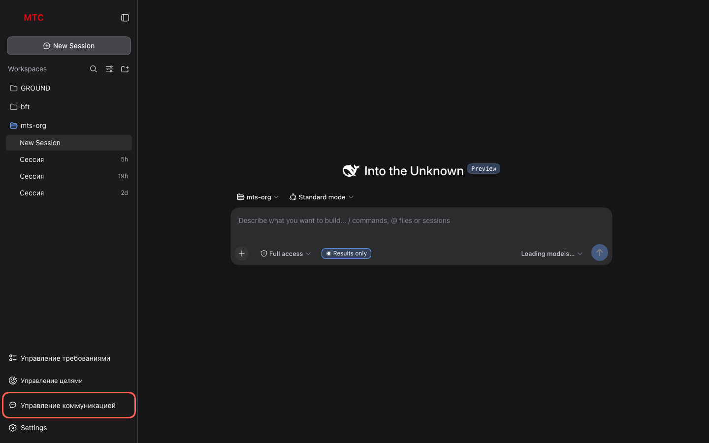
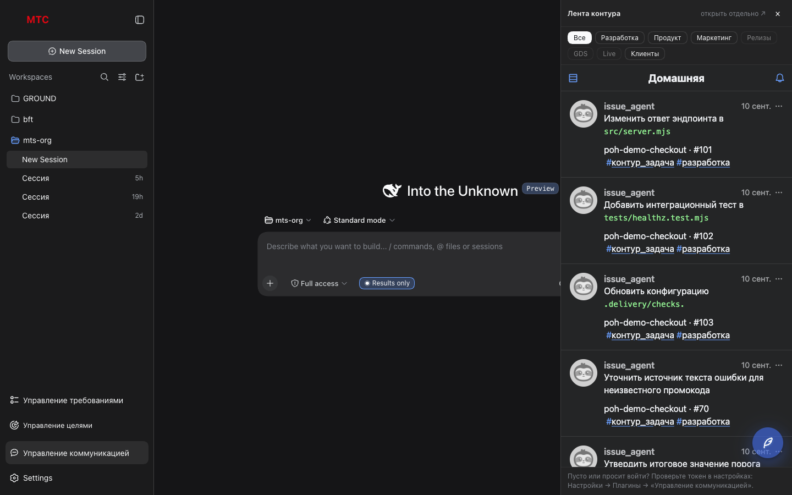
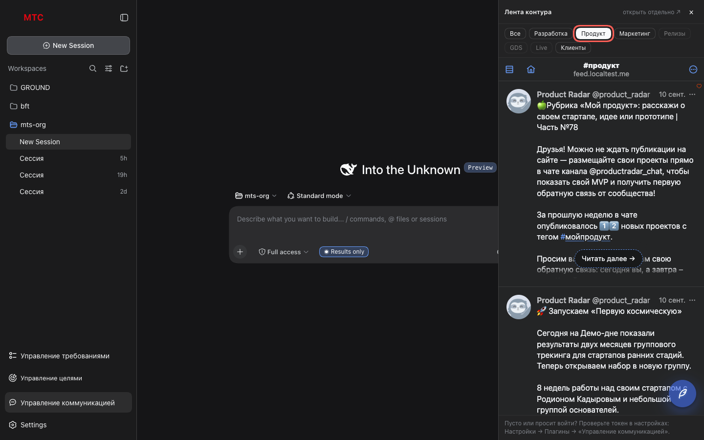
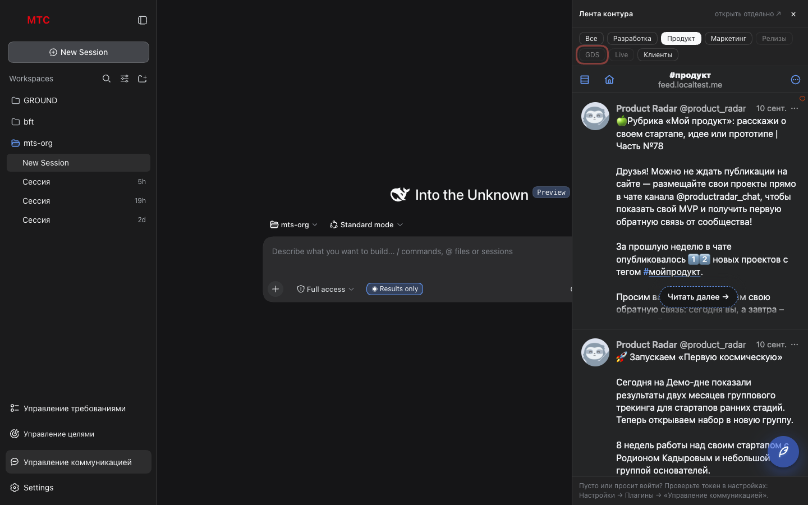

# 1. Лента и фильтр по меткам

Увидеть ленту контура, не покидая харнесса, и быстро сузить её до одной темы.

## Шаги

### 1. Открой столбец

Нажми **«Управление коммуникацией»** в подвале левой панели. Справа откроется столбец
«Лента контура»: шапка, пилюли меток, лента.

Вход в ленту выполняется сам — страницы входа нет. Если фрейм всё же просит войти,
токен не задан или не принят: см. сценарий 2.

### 2. Выбери метку

Пилюля **«Продукт»** переводит ленту на срез `#продукт`. Одна метка за раз: повторный
клик по **«Все»** возвращает домашнюю ленту.

### 3. Пустые метки

Метка, под которой постов пока нет, погашена, а не спрятана: видно, что фильтр есть,
а содержимого под ним ещё не было. Подсказка по наведению говорит это словами.

### 4. Пост, ветка, ответ

Клик по посту открывает его поверх ленты — с веткой ответов, опросом (если это
развилка) и полем ответа. Это поведение клиента ленты, не раздела: ответ уходит в
ленту от твоей учётки, голос по развилке — в контур.

### 5. Открыть отдельно

**«открыть отдельно ↗»** в шапке — тот же клиент во вкладке на всю ширину, с панелью
Shortcuts и всеми настройками клиента.

## Что стоит знать

- Ширина столбца фиксирована (420 px): в ней клиент уходит в мобильную раскладку, где
  Shortcuts становятся нижними вкладками.
- Столбец накрывает правый край беседы, а не сдвигает её. Закрыть — «×» в шапке.
- Тема клиента следует системной, а не переключателю харнесса; меняется в настройках
  самого клиента один раз.
