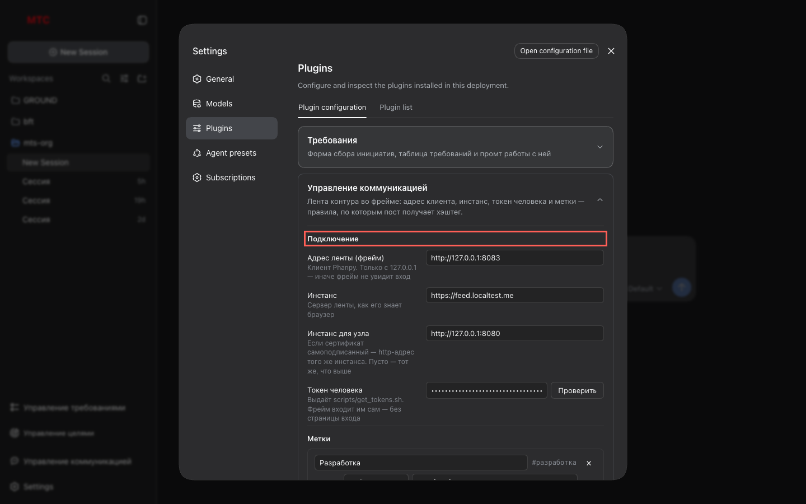
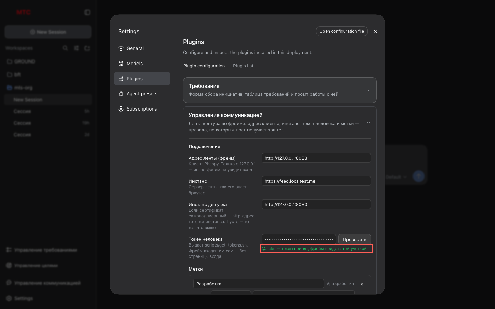
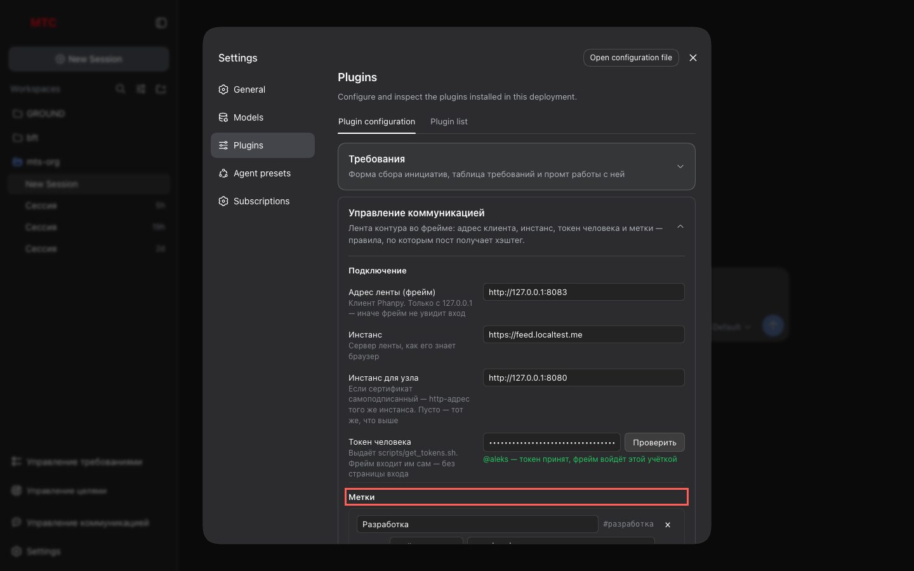
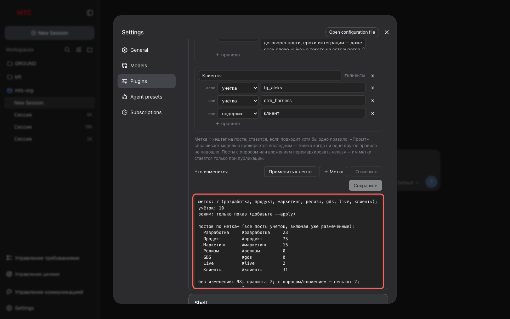

# 2. Настройки: подключение и метки

Задать, откуда берётся лента и кем в неё входить, и описать метки — правила, по которым
пост получает хэштег.

## Шаги

### 1. Открой карточку

**Настройки → Плагины → Конфигурация плагинов → «Управление коммуникацией»**. Карточка
раскрывается на месте; «Сохранить» и «Отменить» — внизу карточки, «Не сохранено» — в её
заголовке, пока есть правки.

### 2. Подключение

| Поле | Что задать |
|---|---|
| Адрес ленты (фрейм) | `http://127.0.0.1:8083` — только `127.0.0.1`, не `localhost` |
| Инстанс | `https://feed.localtest.me` |
| Инстанс для узла | `http://127.0.0.1:8080`, если сертификат самоподписанный |
| Токен человека | из `scripts/get_tokens.sh aleks` в `poh-feed-poc` |

Сначала **«Сохранить»**, потом **«Проверить»**: узел сходит в инстанс и назовёт
учётку. Кнопка погашена, пока есть несохранённые правки — проверяется то, что записано.

### 3. Метки

Метка — название и правила. Подходит хотя бы одно правило — метка стоит.

| Вид | Что сравнивает |
|---|---|
| учётка | автор поста: `product_radar`, `openhands` |
| тег на посте | уже стоящий хэштег: `контур_приёмка` |
| содержит | подстрока без учёта регистра |
| регулярка | регулярное выражение |
| промт | описание для модели — когда признаков в тексте нет, а по смыслу пост туда относится |

Название превращается в хэштег само (`Разработка` → `#разработка`). Сломанное правило
не даст сохранить — причина написана под списком.

### 4. Перемаркировка

**«Что изменится»** прогоняет правила по уже опубликованным постам и показывает, что
изменилось бы: сколько постов под каждой меткой, сколько править, сколько нельзя.
**«Применить к ленте»** — то же, но правит. Обе погашены, пока есть несохранённые
правки, и обе недоступны, если команда не задана в конфигурации плагина.

## Что стоит знать

- **Промт** проверяется последним и только для меток, не подошедших механически; один
  вопрос модели на пост, ответ запоминается. Без модели (`LABELS_LLM_*` в `.env` ленты)
  перемаркировка отказывается стартовать вслух.
- **Посты с опросом или вложением** перемаркировать нельзя — правка убивает опрос. Им
  метки ставятся только при публикации; перемаркировка перечисляет их отдельной строкой.
- Метки зеркалятся в `communication/labels.json` — тот же файл читают мост ленты и
  перенос из Telegram. Правится он здесь, не руками.
